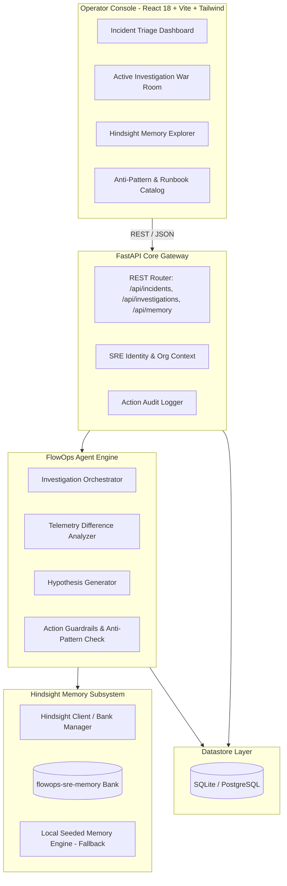

# FlowOps Memory - System Architecture & Design

> **"The AI SRE Agent That Learns From Every Incident"**  
> *Failure-Aware Organizational Memory for Production Incident Response.*

---

## 1. Problem Space & Engineering Motivation

### 1.1 The Operational Knowledge Gap
During critical production outages, on-call SREs face high stress, incomplete telemetry, and strict time constraints. A chronic issue across engineering teams is **repeated operational mistakes**:
- An engineer encounters database pool saturation and restarts the service, causing an avalanche connection storm that takes down the entire database cluster.
- An engineer flushes a distributed cache under peak traffic, creating a cache stampede that overwhelms downstream services.
- A new responder spends 45 minutes rediscovering a known configuration quirk that was diagnosed and resolved by another team member three months prior.

Generic AI chatbots often worsen these scenarios because they repeat generic textbook remediations (e.g., *"Try restarting the application"* or *"Clear the cache"*) with zero organizational context or historical failure awareness.

### 1.2 The FlowOps Solution
**FlowOps Memory** introduces **Failure-Aware Organizational Memory** into incident response workflows. Built with a dedicated memory subsystem (Hindsight integration), FlowOps:
1. **Recalls Historical Experiences:** When an alert triggers, the agent queries past incidents sharing similar telemetry signals, service topologies, and symptoms.
2. **Surfaces What Failed vs. What Worked:** Explicitly highlights historical troubleshooting attempts that failed or degraded system health, preventing repeat mistakes.
3. **Identifies Critical Differentiators:** Pinpoints subtle differences between current incident telemetry and past baselines (e.g. traffic delta, connection pool utilization, deployment versions).
4. **Retains Learnings Automatically:** When an incident is resolved, root causes, successful actions, and key lessons are synthesized and stored back into the organizational memory bank.

---

## 2. System Architecture

---

## 3. Core Component Breakdown

### 3.1 Hindsight Memory Integration
The memory system operates against a persistent memory bank: `flowops-sre-memory`.
- **Experience Ingestion:** Every resolved incident stores a structured record containing:
  - `service`: Targeted microservice or infrastructure component.
  - `symptoms`: Latency spikes, error rates, saturation metrics.
  - `troubleshooting_history`: Step-by-step actions taken and recorded outcomes (`SUCCESS`, `FAILED`, `INCONCLUSIVE`).
  - `what_worked`: The verified mitigation step.
  - `what_failed`: Hazardous or ineffective attempts.
  - `key_lesson`: Architectural takeaways for future responders.
- **Semantic & Keyword Recall:** When investigating an incident, the agent queries the memory bank using telemetry context, service name, and error signatures.
- **Local Fallback Engine:** For offline resilience during hackathon demonstrations or network isolation, an embedded in-memory vector/keyword engine is provided with 25+ real-world seeded production incidents.

### 3.2 SRE Agent Reasoning Loop
When an engineer triggers an investigation:
1. **Telemetry Ingestion:** Collects current error rate, p99 latency, DB connection utilization, recent git commits, and recent log excerpts.
2. **Memory Retrieval:** Recalls top-k matching historical incidents from Hindsight.
3. **Differential Analysis:** Compares current metrics with past incidents (e.g., *"Unlike INC-2024-088 where traffic surged by 150%, current traffic is only +31%, indicating query inefficiency rather than raw volume"*).
4. **Hypothesis Formulation:** Produces ranked hypotheses backed by historical confidence scores.
5. **Action Recommendation:** Suggests safe, step-by-step remediation procedures while explicitly flagging anti-patterns.

### 3.3 Human-in-the-Loop Execution
In production SRE environments, autonomous script execution without human oversight poses severe availability risks. FlowOps enforces a **Human-in-the-Loop** model:
- The agent presents actionable recommendations with expected impact and historical precedent.
- The human SRE clicks to execute or override actions.
- Executed actions are logged to the incident audit trail and reflected in the post-incident learning capture.

---

## 4. Technology Stack

| Layer | Technologies | Rationale |
|---|---|---|
| **Frontend** | React 18, TypeScript, Vite, Tailwind CSS, Lucide Icons | Fast compile times, responsive SRE dark console aesthetic, zero bloat. |
| **Backend** | Python 3.12, FastAPI, Pydantic v2, SQLAlchemy | Async request handling, strong typing, automatic OpenAPI documentation. |
| **Memory Engine** | Hindsight API client, SQLite local memory bank fallback | Dual-mode memory storage ensuring 100% reliability in cloud and offline modes. |
| **Database** | SQLite (development/demo) / PostgreSQL (production ready) | Zero configuration local testing with drop-in Supabase/PostgreSQL schema. |
| **Testing** | Pytest, TestClient, HTTPX | Comprehensive API contract and agent workflow validation. |
