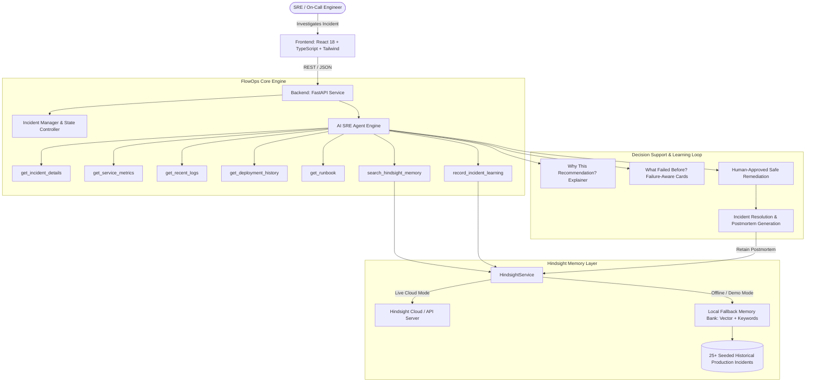

# FlowOps Memory

### "The AI SRE Agent That Learns From Every Incident"
**Failure-Aware Organizational Memory for Production Incident Response & Reliability Engineering**
**Built with:** Python 3.12 (FastAPI, SQLAlchemy) &bull; React 18 (TypeScript, Vite, Tailwind CSS) &bull; Hindsight Memory Engine &bull; SQLite / PostgreSQL

---

## 1. The Core Problem

When production breaks at 3:00 AM, SREs and on-call DevOps engineers don't suffer from a lack of monitoring dashboards or logs. **They suffer from the loss of organizational experience.**

In real engineering organizations:
- A previous engineer already spent 3 hours diagnosing an identical connection pool saturation three months ago.
- They tried restarting the service—**and triggered a catastrophic thundering herd reconnection storm.**
- They tried flushing Redis—**and wiped out the cache, sending 300% more traffic onto the struggling database.**
- Finally, they discovered the real fix: **increasing PgBouncer connection leases from 100 to 250.**
- But that hard-won experience was locked away in an archived Slack thread or a forgotten postmortem document.

When the same incident recurs today, **the new engineer repeats the exact same failed attempts**, extending downtime from 10 minutes to over an hour.

---

## 2. The Solution: Failure-Aware Organizational Memory

**FlowOps Memory** transforms AI incident response from a generic stateless chatbot into an experienced SRE partner with **Failure-Aware Organizational Memory**.

The agent remembers the entire troubleshooting trajectory:
$$	ext{Incident} \longrightarrow 	ext{Symptoms} \longrightarrow 	ext{Hypotheses} \longrightarrow 	ext{Failed Attempts} \longrightarrow 	ext{Successful Fix} \longrightarrow 	ext{Lesson Learned}$$

When a new incident strikes, the agent doesn't just retrieve an old ticket—it reasons over past successes **and explicitly warns against proven dead-ends**:

> *"This incident strongly resembles INC-1042 (94% match). In that incident, restarting the service failed by triggering a thundering herd reconnection storm. The successful remediation was increasing the PgBouncer database connection pool. Current metrics show the exact same 498/500 connection lease exhaustion pattern."*

---

## 3. Key Architectural Pillars & Innovations

| Core Pillar | Technical Architecture | Operational Impact |
| :--- | :--- | :--- |
| **Failure-Aware Memory** | Actively records and surfaces what **failed** in past incidents, not just what succeeded. | Prevents lethal recurring mistakes (e.g. restart cascades under DB pool exhaustion, cache dumps under peak load). |
| **Biomimetic Memory Engine** | Dual-mode memory layer with Hindsight API client and zero-latency local fallback bank (`flowops-sre-memory`). | Real-time semantic similarity search, cross-incident reflection, and automatic post-mortem experience retention. |
| **Differential Telemetry Analysis** | Automated comparison between active telemetry and historical incident baselines. | Pinpoints critical differentiators (e.g. traffic surges vs query regressions) within seconds. |
| **Human-in-the-Loop Guardrails** | Staged recommendation protocol with execution safety checks and risk classification. | Eliminates autonomous rogue actions in production while accelerating SRE mitigation decisions. |
| **SRE-Optimized Operator Console** | High-density React 18 + TypeScript + Tailwind dark interface with real-time telemetry gauges and incident timeline. | Drastically reduces cognitive load and context-switching for on-call engineers at 3 AM. |

---

## 4. System Architecture



---

## 5. Hindsight Integration

FlowOps Memory isolates all memory operations inside `backend/app/services/hindsight_service.py` adhering to official Hindsight architecture:

### Biomimetic Memory Networks
1. **World Network**: Objective service topology, baseline latencies, connection limits, and deployment versions.
2. **Experience Network**: Exact chronological records of incidents, tried hypotheses, failed commands, and recovery times.
3. **Observation Network**: Recurring failure patterns across microservices (e.g. database pool saturation during flash campaigns).
4. **Opinion Network**: Actionable SRE runbooks, engineer feedback, and organizational rules.

### Core Operations
- **`recall(query, service)`**: Queries Hindsight for matching historical experiences using hybrid semantic retrieval.
- **`retain(lesson)`**: Saves confirmed postmortem lessons, failed approaches, and recovery metadata into persistent memory.
- **`reflect()`**: Synthesizes recurring failure patterns and calculates MTTR reduction statistics.

### Dual Operating Modes
- **Real Hindsight Cloud**: Activated automatically when `HINDSIGHT_API_KEY` is configured in `.env`.
- **Local Seeded Memory Engine**: Offline fallback pre-seeded with **25+ realistic production incidents** across 5 microservices (`checkout-api`, `payment-api`, `order-api`, `auth-service`, `notification-service`).
- **Zero Ambiguity**: The UI header displays a persistent badge clearly identifying whether **`REAL HINDSIGHT CLOUD`** or **`LOCAL SEEDED MEMORY ENGINE`** is active.

---

## 6. Signature Features

### 🎯 Feature 1: "Why This Recommendation?"
Every AI diagnosis includes an expandable, grounded explanation showing the chain of evidence from accumulated experience:
- Explains current telemetry correlation (e.g. 498/500 DB leases = 99.6% saturation).
- Cites specific historical precedents (INC-1042, INC-0871, INC-0652).
- Explains why the proposed remediation was selected over alternatives.

### ❌ Feature 2: "What Failed Before?" (Failure-Aware Memory)
Prevents catastrophic troubleshooting anti-patterns by displaying past failures:
- ❌ **Restart service pods**: *Failed in INC-1042 (reconnection thundering herd).*
- ❌ **Flush Redis cache**: *Failed in INC-1042 (forced cart queries directly onto saturated DB).*
- ⚠️ **Rollback deployment**: *Partial in INC-0871 (stopped new leaks but left lingering idle connections).*
- ✅ **Scale DB connection pool**: *Succeeded in INC-1042 (stabilized queues in 90 seconds).*

### 📊 Feature 3: The Learning Curve (Before vs After)
An interactive side-by-side comparison modal demonstrating:
- **Without Memory (Generic SRE)**: Blindly recommends restarting pods and flushing cache; extends outage by 45 minutes.
- **With FlowOps Memory**: Immediately identifies connection pool bottleneck, warns against restarting, and resolves the issue in 11 minutes.

---

## 7. The 60-Second Demo Script

Follow this exact narrative during live judging:

1. **The Incident Appears (0:00 - 0:15)**:
   - Open `http://localhost:5173`. Point out the active **SEV-1 incident on `checkout-api`**:
   - Error Rate: **23.4%**, P99 Latency: **8.7s**, DB Connections: **498/500**.
   - Show the header badge indicating **Hindsight Memory Engine** with 1,284 remembered incidents.

2. **The Investigation (0:15 - 0:30)**:
   - Click **"Investigate with FlowOps →"**.
   - Click **"Run AI Agent Investigation"**.
   - Watch the agent execute 7 distinct tool invocations (`get_incident_details`, `get_service_metrics`, `get_recent_logs`, `get_deployment_history`, `search_hindsight_memory`).

3. **Failure-Aware Reasoning (0:30 - 0:45)**:
   - Hindsight retrieves **INC-1042 (94% relevance)**.
   - Point out **"WHAT FAILED BEFORE?"**: Show the red failure warnings explaining why restarting pods and flushing cache failed in the past.
   - Expand **"WHY THIS RECOMMENDATION?"**: Highlight the historical evidence grounding the diagnosis.

4. **Safe Human Decision & Resolution (0:45 - 0:60)**:
   - Point out that FlowOps **does not blindly execute commands**—it provides a safe `kubectl patch` proposal with risk assessment.
   - Click **[ Approve Recommendation ]**.
   - Watch live telemetry recover in real-time: error rate drops to **0.04%**, latency drops to **98ms**, connections normalize.

5. **The Learning Loop (0:60 - 0:75)**:
   - Click **[ Resolve & Learn Postmortem → ]**.
   - Review the auto-generated postmortem with root cause, successful fix, and prevented anti-patterns.
   - Click **[ SAVE TO HINDSIGHT MEMORY ]**.
   - Watch the pulse animation confirm: *"HINDSIGHT MEMORY UPDATED — New organizational experience recorded."*

6. **The Takeaway**:
   - Open **Organizational Memory Explorer**. Show that the newly resolved incident is now permanently part of organizational memory to protect future engineers!

---

## 8. Quick Start & Setup

### Prerequisites
- Python 3.10+ (tested on Python 3.12)
- Node.js 18+ (tested on Node v24)
- Git

### 1. Clone & Configure
```bash
git clone https://github.com/your-username/flowops-memory.git
cd flowops-memory
cp .env.example .env
```

### 2. Backend Setup
```bash
cd backend
python -m pip install -r requirements.txt
python -m pip install hindsight-api hindsight-client
cd ..
```

### 3. Frontend Setup
```bash
npm install
npm run build
```

### 4. Run Locally
**Option A: 1-Click Windows Launcher**
Double click `run.bat` or run:
```powershell
./run.ps1
```

**Option B: Manual Terminal Execution**
Terminal 1 (Backend):
```bash
python -m uvicorn backend.app.main:app --reload --port 8000
```
Terminal 2 (Frontend):
```bash
npm run dev
```

Visit:
- **SRE Dashboard**: `http://localhost:5173`
- **Interactive API Docs**: `http://localhost:8000/docs`

---

## 9. Automated Test Suite

FlowOps Memory includes end-to-end integration tests covering health checks, incident retrieval, AI diagnosis, Hindsight memory recall/retention, action execution, and demo resets:

```bash
python -m pytest backend/tests/test_flowops.py -v
```

Expected output:
```text
test_health PASSED                      [ 20%]
test_list_and_get_incident PASSED       [ 40%]
test_agent_diagnose PASSED              [ 60%]
test_memory_explorer_and_retain PASSED  [ 80%]
test_action_and_demo_reset PASSED       [100%]
============================== 5 passed in 1.19s ==============================
```

---

## 10. Safety & Responsible AI Architecture

- **No Blind Autopilot**: FlowOps Memory is built as a decision-support copilot. Dangerous production infrastructure modifications require human SRE approval.
- **Risk Assessment**: Every proposed remediation is scored with a clear risk tier (`Low`, `Medium`, `High`) and backed by historical incident evidence.
- **Grounded AI Confidence**: Confidence percentages are explicitly derived from Hindsight semantic similarity and confirmed precedent counts—not uncalibrated LLM guesses.

---

## 11. Team & Acknowledgments

Built with ❤️ for **HackwithHyderabad Hindsight AI Agents Hackathon**.
- **Memory Engine**: Powered by [Hindsight](https://github.com/vectorize-io/hindsight).
