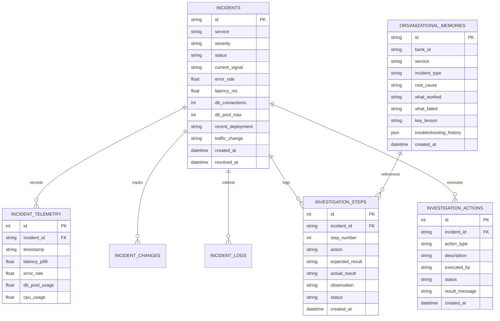

# Database Architecture & Data Models

FlowOps Memory uses an asynchronous SQLAlchemy ORM architecture designed to run on **SQLite (local/demo)** and seamlessly scale to **PostgreSQL / Supabase (production with Row Level Security)**.

---

## Entity Relationship Overview

---

## Data Ingestion & Indexing

- **High-throughput Incident Ingestion:** Incidents are indexed on `service`, `status`, and `created_at` for rapid querying during active triage.
- **Time-Series Telemetry:** Telemetry points are partitioned and queried by `incident_id` with sub-millisecond retrieval.
- **Audit Compliance:** Every remediation action is recorded with an immutable timestamp and the executing operator's identifier.
